<h1 align="center">r2o-check</h1>
<p align="center">
  
  <p align="center">
    <a href="https://github.com/mansurjisan/r2o-check/actions/workflows/ci.yml"></a>
    <a href="https://www.python.org/"></a>
    <a href="LICENSE"></a>
      <p align="center">
    <strong>NCO Implementation Standards v11.0 compliance checker for NOAA operational model and workflow code</strong>
  </p>

  </p>
</p>


r2o-check is an automated compliance checker for NOAA operational model packages. It validates repositories against the [NCO WCOSS2 Implementation Standards v11.0](https://www.nco.ncep.noaa.gov/idsb/implementation_standards/) - enforcing directory structure, naming conventions, required environment variables, build targets, modulefile structure, version file format, and ecFlow script requirements - and runs in CI to catch compliance issues before code reaches NCO review.

## Install

```bash
pip install r2o-check
```

## Usage

```bash
r2o-check lint /path/to/your/repo
```

```
┏━━━━━━━━━━┳━━━━━━━━━━━━┳━━━━━━━━━━━━━━━━━━━━━━━━━━━━━━━━━━━┳━━━━━━━━━━━━━━━━━━━━━━━┓
┃ Status   ┃ Rule       ┃ Message                           ┃ Fix hint              ┃
┡━━━━━━━━━━╇━━━━━━━━━━━━╇━━━━━━━━━━━━━━━━━━━━━━━━━━━━━━━━━━━╇━━━━━━━━━━━━━━━━━━━━━━━┩
│ ✔ PASS   │ R2OSTR001  │ Required directory 'ecf/' exists. │                       │
│ ✘ FAIL   │ R2OSTR008  │ Missing directory 'modulefiles/'. │ Create 'modulefiles/' │
│ ✘ FAIL   │ R2OECF001  │ Missing %include <head.h>         │ Add head.h/tail.h     │
└──────────┴────────────┴───────────────────────────────────┴───────────────────────┘
```

---

## What It Checks

| Category | What it validates |
|---|---|
| **Structure** | Required directories (`ecf/`, `jobs/`, `scripts/`, `ush/`, `sorc/`, `parm/`, `versions/`, `modulefiles/`) |
| **Naming** | J-job pattern (`JMODEL_TASK`), ex-script pattern (`exmodel_task.sh`), modulefile format, ush scripts |
| **Environment** | J-job variables from NCO Table 1 (`NET`, `RUN`, `PDY`, `COMIN`, `COMOUT`, etc.) |
| **Build** | Makefile targets (`all`, `debug`, `install`, `clean`) and CMake equivalents |
| **Modules** | Modulefile dependencies (compiler, libraries) |
| **Versions** | `run.ver` / `build.ver` existence and format |
| **ecFlow** | `%include <head.h>/<tail.h>`, paired `ecflow_client` calls, trap handlers, hard-coded paths |

31 rules total. Each cites the specific NCO v11.0 section it enforces.

---

## Output Formats

```bash
r2o-check lint . --format json                   # Structured JSON
r2o-check lint . --format markdown                # PR-comment-ready
r2o-check lint . --format html -o report.html     # Self-contained HTML
```

## Auto-Fix

```bash
r2o-check fix /path/to/repo             # Preview (dry run)
r2o-check fix /path/to/repo --apply     # Apply safe fixes
```

Creates missing required directories and stubs version files. Does not auto-fix naming, environment, or ecFlow rules.

## Repo Types

Configure in `.r2o-check.yml` — rules auto-filter based on your repo type:

```yaml
repo_type: operational_model   # all rules
# repo_type: workflow          # structure, naming, env, modules, versions, ecflow
# repo_type: model_source      # build, modules
# repo_type: library           # build only
# repo_type: tool              # no rules (clean pass)
```

## CI Integration

```yaml
# .github/workflows/r2o-check.yml
name: NCO Compliance
on: [push, pull_request]
jobs:
  compliance:
    runs-on: ubuntu-latest
    steps:
      - uses: actions/checkout@v4
      - uses: actions/setup-python@v5
        with:
          python-version: "3.12"
      - run: pip install r2o-check
      - run: r2o-check lint .
```

---

## Docs

- [Quickstart](docs/quickstart.md) - install, configure, integrate
- [Rules Reference](docs/rules.md) - every rule with examples and fix hints
- [NCO Standards Mapping](docs/nco-standards-mapping.md) - rule ID to NCO section
- [Contributing](CONTRIBUTING.md) - dev setup, adding rules

## License

[Apache-2.0](LICENSE)
